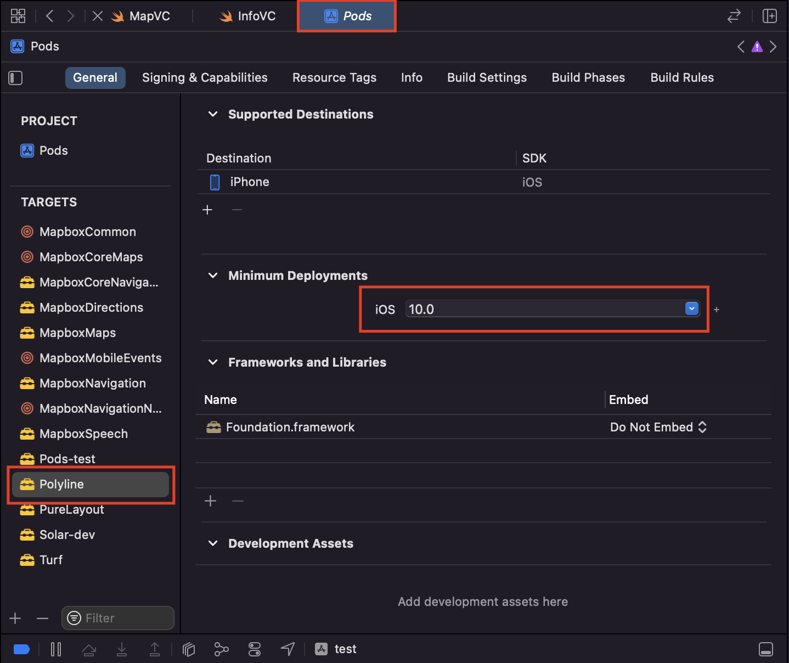

# Languages and Tools
 <div align="center">
 
 

# How install application
In terminal open project directory and use command
```bash
pod install
``` 
# Fix Compiling for iOS 10.0, but module 'Polyline'
In Pods change of Polyline 'Minimum Deployments' iOS to 10.0


